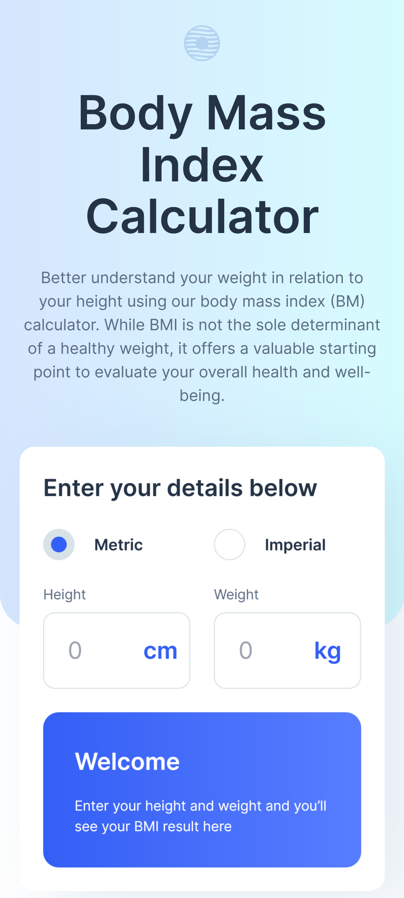
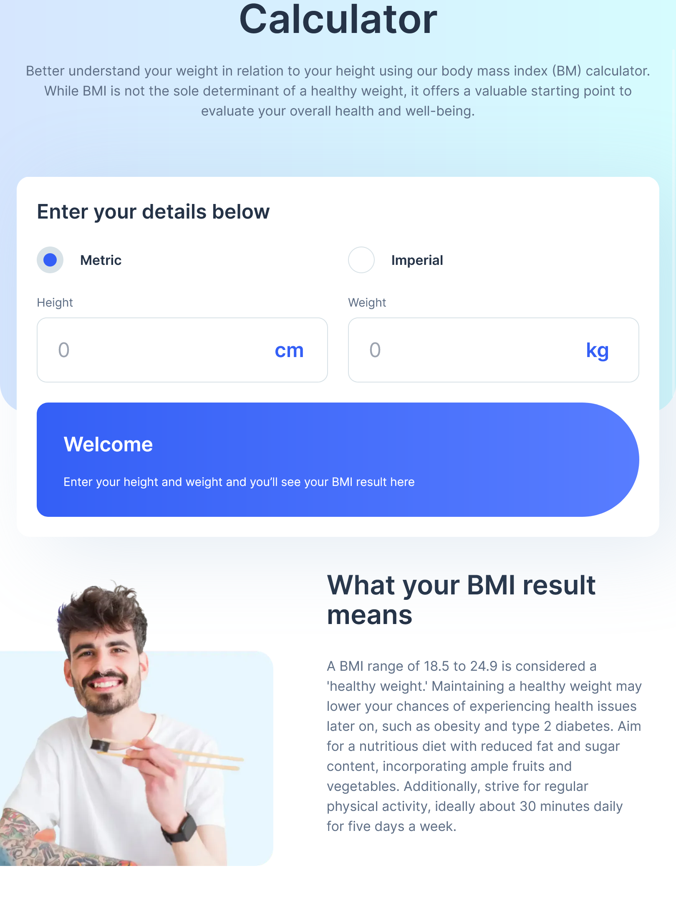
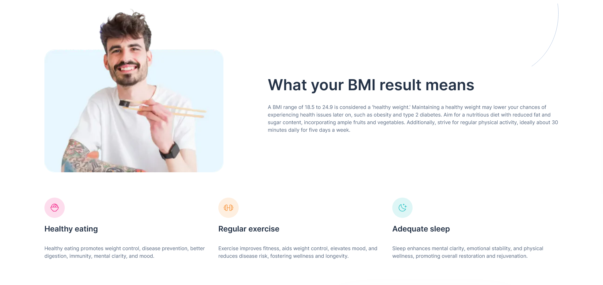

# Frontend Mentor - Body Mass Index Calculator solution

This is a solution to the [Body Mass Index Calculator challenge on Frontend Mentor](https://www.frontendmentor.io/challenges/body-mass-index-calculator-brrBkfSz1T). Frontend Mentor challenges help you improve your coding skills by building realistic projects. 

## Table of contents

- [Overview](#overview)
  - [The challenge](#the-challenge)
  - [Screenshots](#screenshots)
  - [Links](#links)
- [My process](#my-process)
  - [Built with](#built-with)
  - [What I learned](#what-i-learned)
  - [Continued development](#continued-development)
  - [Useful resources](#useful-resources)
- [Author](#author)

## Overview

### The challenge

Users should be able to:

- Select whether they want to use metric or imperial units
- Enter their height and weight
- See their BMI result, with their weight classification and healthy weight range
- View the optimal layout for the interface depending on their device's screen size
- See hover and focus states for all interactive elements on the page

### Screenshots



<p>
  
</p>

### Links

- Solution URL: [Frontend Mentor](https://www.frontendmentor.io/solutions/responsive-bmi-calculator-using-react-nextjs-and-tailwind-SL3RAECmfc)
- Live Site URL: [Vercel](https://bmi-calculator-nu-silk.vercel.app/)

## My process

### Built with

- Semantic HTML5 markup
- CSS custom properties
- Flexbox
- CSS Grid
- Mobile-first workflow
- [React](https://reactjs.org/) - JS library
- [Next.js](https://nextjs.org/) - React framework
- [TailwindCSS](https://tailwindcss.com/) - CSS Library

### What I learned

This project really challenge my understanding of CSS and forms. The layouts can probably use a few improvements but it was nice learn a lot about flex and grid.

The code below was the most fun to write, I'm sure there is a better way but I think I did a good job arranging the elements using css grid.

```html
<div className="grid gap-y-5 md:grid-cols-4 md:gap-x-5 lg:grid-cols-6 lg:gap-10 lg:-mt-[18rem]">
  <SmallCard icon="/images/icon-gender.svg" alt="Mars and venus icon" title="Gender" className="md:col-span-2 lg:col-start-4 lg:ml-[5rem] lg:-mr-[5rem]">
    The development and body fat composition of girls and boys vary with age. Consequently, a child's age and gender are considered when evaluating their BMI.
  </SmallCard>
  <SmallCard icon="/images/icon-age.svg" alt="Cake icon" title="Age" className="md:col-span-2 lg:col-start-3">
    In aging individuals, increased body fat and muscle loss may cause BMI to underestimate body fat content.
  </SmallCard>
  <SmallCard icon="/images/icon-muscle.svg" alt="Biceps icon" title="Muscle" className="md:col-span-2 lg:col-start-5">
    BMI may misclassify muscular individuals as overweight or obese, as it doesn't differentiate muscle from fat.
  </SmallCard>
  <SmallCard icon="/images/icon-pregnancy.svg" alt="Baby icon" title="Pregnancy" className="md:col-span-2 lg:col-start-2">
    Expectant mothers experience weight gain due to their growing baby. Maintaining a healthy pre-pregnancy BMI is advisable to minimise health risks for both mother and child.
  </SmallCard>
  <SmallCard icon="/images/icon-race.svg" alt="Person icon" title="Race" className="md:col-span-2 md:col-start-2 lg:col-start-4">
    Certain health concerns may affect individuals of some Black and Asian origins at lower BMIs than others. To learn more, it is advised to discuss this with your GP or practice nurse.
  </SmallCard>
</div>
```

### Continued development

This project has a lot of room for improvement, some examples include:

* Limit the inputs to receive only numeric values
* Animate the transition between metric and imperial systems

### Useful resources

- [React Hook Form 7 Custom Radio Buttons Tutorial](https://www.positronx.io/react-hook-form-custom-radio-buttons-tutorial/) - This tutorial helped me understand how to connect a radio group to the react hook form.

## Author

- Website - TBD
- Frontend Mentor - [@marxguimaraes](https://www.frontendmentor.io/profile/marxguimaraes)
